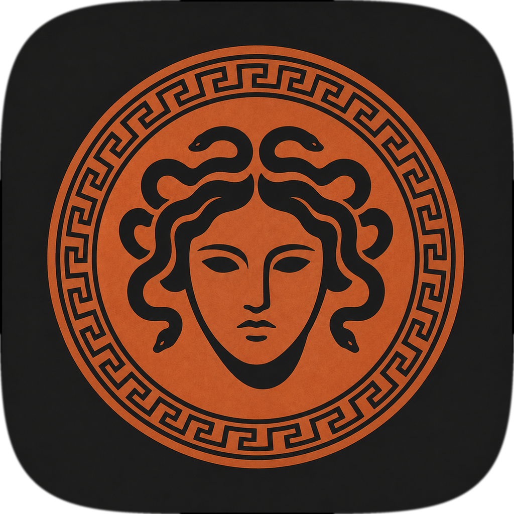

<p align="center">
  
</p>

# Aspis

Um app nativo de macOS, de interface ultra-minimalista, que funciona como um
**escudo entre você e o YouTube**. Em vez de abrir o feed algorítmico, você abre
o Aspis e vê uma **lista de texto enxuta, ranqueada pelos seus
objetivos de vida** — sem thumbnails, sem títulos sensacionalistas. O foco não é
assistir vídeos: é **extrair e sintetizar** o que importa e arquivar num
"segundo cérebro" (Obsidian e Anki). Assistir é a exceção.

> A metáfora: as mídias digitais são uma Medusa. Encará-las de frente petrifica.
> Perseu não a derrotou olhando-a — mirou o reflexo no escudo polido. O app é
> esse escudo: você nunca encara o feed direto, vê só um reflexo mediado que
> mostra o que serve aos seus objetivos e descarta o resto.

## Como funciona

1. Uma **rotina diária** (`routine.py`, agendada via `launchd`) lê os canais que
   você assina, pega os vídeos novos, **ranqueia pelos seus pilares** e
   **sintetiza** os melhores — tudo num SQLite local.
2. Você abre o **app** e lê a lista ranqueada + as sínteses.
3. Para cada item você decide: **assistir** (raro), **guardar** (nota no Obsidian
   e/ou cards no Anki) e, se for assistir depois, **baixar** (o arquivo sincroniza
   com o Android via Syncthing/Drive).

## Arquitetura

- **App local** (não web). Tudo que ele toca é pessoal e fica na sua máquina.
- **Cérebro em Python**; **UI em pywebview** (uma janela nativa com HTML/CSS/JS).
- **Rotina via launchd** escreve no SQLite; o app só lê e exibe.
- **Cérebro plugável**: hoje **Gemini** (ativo) e **Anthropic** (pronto, desligado).
- **Sync para o Android** é off-the-shelf (Syncthing/Drive); o app só escreve na
  pasta configurada.

Estado compartilhado fica em `~/.aspis/` (`config.yaml` + `aspis.db`), para que
o `.app` empacotado e a rotina do `launchd` enxerguem o mesmo dado.

### Módulos

| Arquivo | Papel |
|---|---|
| `app.py` | Janela pywebview + ponte `Api` (Python↔JS). Lê o SQLite e executa as ações. |
| `routine.py` | Job diário: fetch → rank → sintetiza → grava → digest. Idempotente. |
| `accounts.py` | Login do YouTube no app: credencial colada, múltiplos canais, canal ativo. |
| `youtube.py` | Inscrições + vídeos novos do canal ativo (YouTube Data API v3). |
| `transcript.py` | Transcrições (youtube-transcript-api), com fallback se não houver legenda. |
| `brain.py` | **1 chamada de LLM por vídeo**, plugável por provedor (Gemini/Anthropic). |
| `store.py` | SQLite: schema, cache e estado. |
| `obsidian.py` | Nota `.md` no vault + MOC do pilar + nota diária + digest. |
| `anki.py` | Cards via AnkiConnect a partir dos fatos memorizáveis. |
| `download.py` | Wrapper do yt-dlp para a pasta sincronizada. |
| `config.py` / `config.yaml` | Carregador e configuração (pilares, limiar, modelo, caminhos). |

## Setup

### 1. Dependências

```bash
cd aspis
python3 -m venv .venv
./.venv/bin/pip install -r requirements.txt
```

### 2. Configuração

Na primeira execução, o `config.yaml` do projeto é copiado para
`~/.aspis/config.yaml`. Edite **esse** arquivo: pilares, limiar de score,
caminho do vault do Obsidian, pasta de download, e a string do modelo.

### 3. Chave do LLM (cérebro Gemini, ativo)

Crie uma chave no Google AI Studio e exporte:

```bash
export GEMINI_API_KEY="sua-chave"
```

Para trocar para o Anthropic: em `config.yaml`, mude `llm.provider` para
`anthropic`, ponha `enabled: true` no bloco dele, e exporte `ANTHROPIC_API_KEY`.

### 4. YouTube (login dentro do app)

O login é feito **no próprio app**, no botão **Conta** (canto superior direito).
Você só precisa criar uma vez a credencial de API do Google:

1. No [Google Cloud Console](https://console.cloud.google.com/): crie um projeto
   e **habilite a YouTube Data API v3**.
2. Credenciais → Criar credencial → **ID do cliente OAuth** → tipo **App para
   computador**.
3. Como o escopo `youtube.readonly` é "sensível", em "Tela de consentimento OAuth"
   adicione **você mesmo como usuário de teste** (modo de teste — sem precisar de
   verificação do Google).
4. **Baixe o JSON** da credencial. No Aspis: **Conta → cole o JSON → Salvar →
   Conectar**. O navegador abre no login do Google; escolha a **conta** e, se ela
   tiver vários canais (brand accounts), o **canal**.

Você pode **conectar vários canais** e alternar qual é o **ativo** na tela Conta.
A credencial fica em `~/.aspis/oauth_client.json` e os tokens em
`~/.aspis/accounts/` (cada usuário usa a própria credencial; nada vai pro Git).
A rotina diária (`launchd`) usa sempre o canal ativo.

> Alternativa sem login: preencha `youtube.channels_manuais` no `config.yaml` com
> os channel IDs e exporte `YOUTUBE_API_KEY`.

### 5. Anki (opcional)

Instale o add-on **AnkiConnect** no Anki desktop e deixe o Anki **aberto** quando
for salvar cards.

### 6. Primeira execução

```bash
export GEMINI_API_KEY="sua-chave"
./.venv/bin/python app.py         # abre a janela → conecte o YouTube em "Conta"
./.venv/bin/python routine.py     # depois de conectar: busca + sintetiza
```

Para só ver a interface com dados de exemplo (sem rodar o pipeline):

```bash
./.venv/bin/python store.py --seed
./.venv/bin/python app.py
```

## Agendamento diário (launchd)

1. Edite `com.aspis.daily.plist`: confirme os caminhos e preencha
   `GEMINI_API_KEY` em `EnvironmentVariables` (o launchd **não** herda o ambiente
   do shell). **Não comite a chave.**
2. Instale:

   ```bash
   cp com.aspis.daily.plist ~/Library/LaunchAgents/
   launchctl load ~/Library/LaunchAgents/com.aspis.daily.plist
   ```

O Mac precisa estar acordado às 6h (ou ajuste o horário no plist).

## Instalar (a partir do .dmg da Release)

1. Baixe o `.dmg` mais recente em **[Releases](../../releases)**.
2. Abra o `.dmg` e arraste **Aspis** para **Aplicativos**.
3. **Primeira abertura** (o app não é assinado por uma conta paga da Apple, então
   o Gatekeeper avisa que o desenvolvedor "não pode ser verificado"):
   **clique com o botão direito no Aspis → Abrir → Abrir**. Só na 1ª vez.
   - Se ainda recusar, rode no Terminal:
     `xattr -dr com.apple.quarantine "/Applications/Aspis.app"` e abra de novo.

> Observação: o bundle no disco se chama `Aspis.app` (ASCII, exigência do
> `codesign`), mas o Finder, a janela e o app mostram **"Aspis"**.

## Empacotar como .app / .dmg (build local)

```bash
python3 assets/make_icon.py        # (re)gera o ícone
bash   assets/build_icns.sh        # gera aspis.icns
./make_dmg.sh                      # builda .app, ASSINA (ad-hoc) e empacota o .dmg
open dist/
```

O `make_dmg.sh` builda via py2app, assina o bundle de dentro pra fora
(`assets/sign_app.sh` — necessário porque `codesign --deep` falha na estrutura
do py2app) e empacota o `.dmg` com atalho para `/Applications`. O `.app` é a
interface; o pipeline diário continua rodando pelo launchd com o venv.

## Sync para o Android

Aponte o **Syncthing** (ou Google Drive) para a `download.folder` ↔ uma pasta no
Android e use um *folder player* (ex.: VLC) lá. Não há sync embutido — é
off-the-shelf de propósito.

## Privacidade e avisos

- **Nenhum segredo no código.** Chaves vêm de variáveis de ambiente;
  `client_secret.json` e `token.json` ficam em `~/.aspis/` e fora do Git.
- Transcrição de terceiros e download (yt-dlp) são **zona cinzenta** dos termos do
  YouTube — uso pessoal apenas. A ausência de legenda é tratada com elegância.
- **Assistir abre o arquivo local** no player do sistema — nunca o YouTube — para
  não reintroduzir o feed algorítmico.

## Licença

Uso pessoal.
